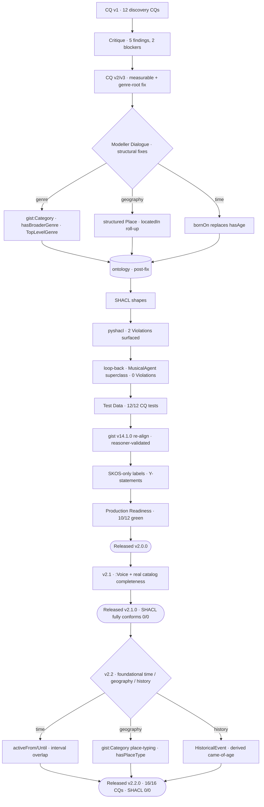
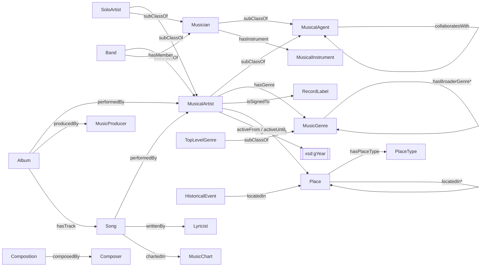

# Music Ontology

[](https://github.com/blacng/music-ontology/actions/workflows/ci.yml)

A **gist-aligned OWL 2 ontology** of the popular- and classical-music domain, built to power a
**music discovery / recommendation** application — and, just as importantly, a worked example of
the **GRL Workshop methodology** (Graph Research Labs, KGC 2026) for engineering ontologies with
LLMs as disciplined pair-modellers.

- **Namespace:** `:` → `https://www.somusicvocabulary.org/music#`
- **Upper ontology:** **gist v14.1.0** — `gist:` → `https://w3id.org/semanticarts/ns/ontology/gist/` (vendored at `ontology/imports/`, reasoner-validated)
- **Scope:** content-based candidate generation (no user/interaction/rating is modelled)
- **Maturity:** research prototype · **released v2.2.0** (SHACL fully conforms)

---

## The approach

Rather than hand-authoring the ontology and hoping it's right, the model is driven through a
disciplined lifecycle: **every requirement is a testable competency question, every generated
artefact is adversarially critiqued, every fix enumerates its downstream regenerations, and the
result is validated by machine (`rdflib`, `pyshacl`, and a HermiT reasoner) rather than by assertion.**

### High-level — the methodology arc


### Detailed — the journey so far



Key decision points along the way:
- **RDF over LPG** — the discovery use case shapes *which questions* we ask, not the storage tech;
  the model stays RDF/OWL (reasoning, SHACL, SPARQL, interoperability).
- **Genres as `gist:Category`, not OWL subclasses** — genre is a cross-cutting facet over artists,
  albums, and songs; subclassing it wouldn't deliver transitivity through `:hasGenre` and would
  fight the team style guide. The chosen pattern gives sound transitive traversal via the
  `owl:TransitiveProperty` `:hasBroaderGenre`, with top genres marked `:TopLevelGenre`.
- **Structure beats free text** — geography became a transitive `:locatedIn` place graph
  (enabling "artists from England"), and the time-varying `:hasAge` became a stable `:bornOn` date.
- **Two primitives carry the foundational CQs (v2.2)** — a **temporal-interval** pattern
  (`:activeFrom`/`:activeUntil`; `gist:actualStartDate`/`End`) and the **place-containment graph**
  underpin same-era discovery, multi-level geography, and "came-of-age during a historical event".
  Geography moved from `:City`/`:Nation` **subclasses** to the same **`gist:Category`** idiom as
  genres (`:hasPlaceType` a `:PlaceType`, ordered by `:broaderPlaceType`) — categorize over
  subclass, so new admin levels are data, not schema.

---

## The model at a glance



~54 classes / ~41 properties across agents, works, a genre taxonomy, instruments (incl. the
`:Voice`/`:VocalInstrument` for singing), events/venues, awards/charts, category-typed places,
historical events, and musical features (key, tempo, time signature). Agents re-parent to
`gist:Person`/`gist:Organization`, works to `gist:Content`, instruments to `gist:Equipment`,
features to `gist:Aspect`, places to `gist:GeoRegion`, historical events to `gist:HistoricalEvent`.
The instance catalog holds ~40 musicians with real band line-ups.

---

## Repository layout

| Path | Contents |
|------|----------|
| `ontology/` | `music_vocabulary_comprehensive.ttl` (**TBox** — model), `music_catalog_data.ttl` (**ABox** — instances), `music_vocabulary_shapes.ttl` (SHACL), `imports/gistCore.ttl` (vendored gist v14.1.0) + `catalog-v001.xml` |
| `scripts/` | transform + validation scripts (`validate_fixes`, `run_cq_tests`, `check_shacl`, `split_tbox_abox`, `load_graphs`, `migrate_*`) |
| `dist/` *(generated)* | named-graph dataset for triplestore ingest: `music_dataset.trig`, `load.ru`, `graph_manifest.json` — git-ignored, rebuilt by `make dataset` |
| `tests/` | CQ regression suite: `test_data.ttl` (synthetic fixtures) + `cq_test_manifest.json` |
| `sdd/` | spec-driven-development control docs: `spec.md`, `plan.md`, `decisions.md` (Y-statements) |
| `docs/` | engineering deliverables: `competency-questions.md`, `shacl-report.md`, `production-readiness.md` |
| `docker-compose.yml` | two Docker services wired to `make`: `reasoner` (ROBOT/HermiT) and `fuseki` (live SPARQL server) |
| `CHANGELOG.md`, `CLAUDE.md` | release notes; guidance for Claude Code in this repo |
| `prompt_library/` *(local-only)* | the seven GRL Workshop prompts — git-ignored |

---

## Running the validation

Requires [`uv`](https://docs.astral.sh/uv/) (Python pinned to 3.14) and `make`.

```bash
make install   # uv sync
make check     # the full gate: model checks + CQ tests + SHACL (run by CI on every PR)

# or individually:
make validate  # parse + SPARQL (genre traversal, place roll-up, …)
make test      # CQ regression suite (16/16)
make shacl     # SHACL conformance — fails only on Violations; Warnings are advisory
make reason    # HermiT consistency check, gist imported (needs Docker; also run as a CI job)

make dataset   # assemble the named-graph dataset (TBox/ABox/SHACL/gist) → dist/*.trig for a triplestore
```

### Reasoning + live SPARQL (Docker Compose)

`docker-compose.yml` provides two services, both wired to `make` (needs Docker):

```bash
make reason       # one-shot HermiT reasoner via ROBOT (compose service `reasoner`)
make serve        # start Apache Jena Fuseki at http://localhost:3030 (dataset `music`)
make fuseki-load  # build dist/ + (re)load its 4 named graphs into Fuseki, then query at the UI
make down         # stop Fuseki (add `docker compose down -v` to also wipe the TDB volume)
```

`make fuseki-load` is idempotent (it `DROP ALL`s then reloads), so re-run it after any ontology
change. Override the endpoint knobs inline, e.g. `make fuseki-load FUSEKI_PW=secret`.

> **Local-dev only.** Fuseki is published on **`127.0.0.1` only** with a **default `admin`
> password** — fine for a laptop, unsafe on a shared/exposed host. `FUSEKI_PW` is the single
> knob (`make serve` propagates it to the server; the load's write credentials are passed via
> `curl -K -`, never on the command line). For anything non-local, set a real password and put
> it behind a proxy — don't widen the port binding.

### Named-graph layout (for triplestore ingest)

The source stays as per-layer Turtle files (git-friendly; what the file-based gate validates).
`make dataset` assigns each file to a named graph and emits `dist/music_dataset.trig` (+ a SPARQL
`LOAD` script and a JSON manifest) for loading into a triplestore:

| Named graph | Source file | Layer |
|-------------|-------------|-------|
| `…/music/tbox` | `music_vocabulary_comprehensive.ttl` | TBox (model) |
| `…/music/abox` | `music_catalog_data.ttl` | ABox (instances) |
| `…/music/shapes` | `music_vocabulary_shapes.ttl` | SHACL |
| `…/ontology/gistCore` | `imports/gistCore.ttl` | gist v14.1.0 |

The default graph carries a SPARQL Service Description (`sd:`) naming the graphs.

`make check` is exactly what GitHub Actions runs on every push and pull request. The one-shot
transforms that produced the current model are preserved and re-runnable in `scripts/`
(`apply_structural_fixes.py`, `migrate_gist.py`, `migrate_skos_labels.py`).

---

## Status

Lifecycle complete — **released [v2.2.0](https://github.com/blacng/music-ontology/releases/tag/v2.2.0)** · SHACL **fully conforms (0/0)**.

| Phase | State |
|-------|-------|
| CQ generation → critique → revision (v4) | ✅ done |
| Modeller Dialogue — structural fixes + `:MusicalAgent` boundary | ✅ done — **0 Violations** |
| SHACL generation | ✅ done — `docs/shacl-report.md` |
| Test data + CQ tests | ✅ done — **16/16 CQs pass** |
| gist v14.1.0 re-alignment | ✅ done — vendored, reasoner-validated |
| SKOS-only labels + Y-statements | ✅ done — `sdd/decisions.md` |
| Production readiness (12-pt gate) | ✅ **10/12 green** (item 4 waived, item 12 = PR sign-off) |
| Vocals + catalog completeness (v2.1) | ✅ done — SHACL **fully conforms (0/0)** |
| Foundational time / geography / history (v2.2) | ✅ done — CQ-13/14/15; `gist:Category` place-typing; `:HistoricalEvent` |
| **Release** | ✅ **v2.0.0** → **v2.1.0** → **v2.2.0** |

See [`sdd/plan.md`](sdd/plan.md) for the live lifecycle tracker and [`sdd/spec.md`](sdd/spec.md)
for the specification.
