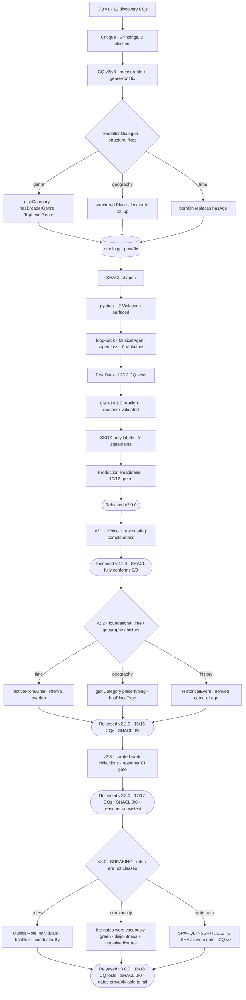
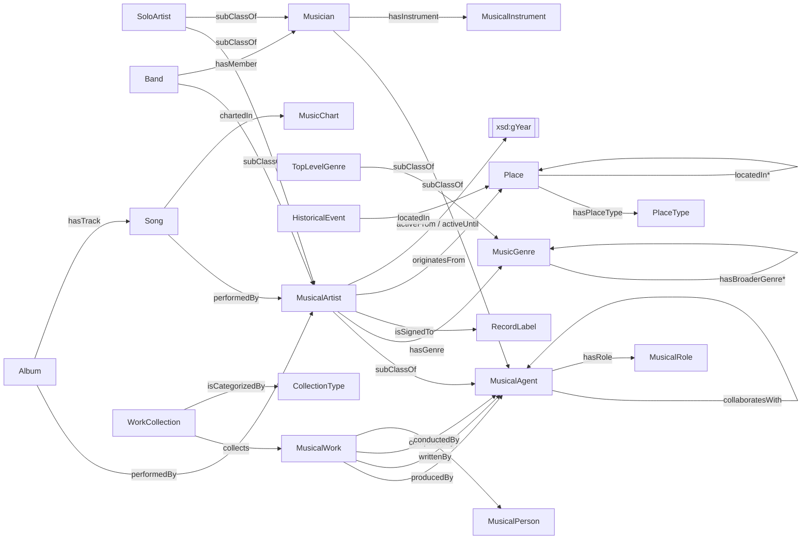

# Music Ontology

[](https://github.com/blacng/music-ontology/actions/workflows/ci.yml)

A **gist-aligned OWL 2 ontology** of the popular- and classical-music domain, built to power a
**music discovery / recommendation** application — and, just as importantly, a worked example of
the **GRL Workshop methodology** (Graph Research Labs, KGC 2026) for engineering ontologies with
LLMs as disciplined pair-modellers.

- **Namespace:** `:` → `https://www.somusicvocabulary.org/music#`
- **Upper ontology:** **gist v14.1.0** — `gist:` → `https://w3id.org/semanticarts/ns/ontology/gist/` (vendored at `ontology/imports/`, reasoner-validated)
- **Scope:** content-based candidate generation (no user/interaction/rating is modelled)
- **Maturity:** research prototype · **released v3.0.0** (SHACL fully conforms · reasoner- and non-vacuity-gated in CI)

---

## The approach

Rather than hand-authoring the ontology and hoping it's right, the model is driven through a
disciplined lifecycle: **every requirement is a testable competency question, every generated
artefact is adversarially critiqued, every fix enumerates its downstream regenerations, and the
result is validated by machine (`rdflib`, `pyshacl`, and a HermiT reasoner) rather than by assertion.**

### High-level — the methodology arc


### Detailed — the journey so far



Key decision points along the way:
- **RDF over LPG** — the discovery use case shapes *which questions* we ask, not the storage tech;
  the model stays RDF/OWL (reasoning, SHACL, SPARQL, interoperability).
- **Genres as `gist:Category`, not OWL subclasses** — genre is a cross-cutting facet over artists,
  albums, and songs; subclassing it wouldn't deliver transitivity through `:hasGenre` and would
  fight the team style guide. The chosen pattern gives sound transitive traversal via the
  `owl:TransitiveProperty` `:hasBroaderGenre`, with top genres marked `:TopLevelGenre`.
- **Structure beats free text** — geography became a transitive `:locatedIn` place graph
  (enabling "artists from England"), and the time-varying `:hasAge` became a stable `:bornOn` date.
- **Two primitives carry the foundational CQs (v2.2)** — a **temporal-interval** pattern
  (`:activeFrom`/`:activeUntil`; `gist:actualStartDate`/`End`) and the **place-containment graph**
  underpin same-era discovery, multi-level geography, and "came-of-age during a historical event".
  Geography moved from `:City`/`:Nation` **subclasses** to the same **`gist:Category`** idiom as
  genres (`:hasPlaceType` a `:PlaceType`, ordered by `:broaderPlaceType`) — categorize over
  subclass, so new admin levels are data, not schema.
- **Curated collections are individuals, not classes (v2.3)** — a `:WorkCollection` (`⊑ gist:Collection`)
  groups related works via the plain relation `:collects`; "works *related to* a seed" stays a query,
  not a stored group. Its `:CollectionType` reuses `gist:Category` again. The **reasoner is now a CI
  gate** (`make reason`, HermiT) — it caught an OWL inconsistency that SHACL/SPARQL couldn't when a
  local property's domain leaked onto a shared gist property via `owl:inverseOf`.
- **Roles are what an agent *does*, not what it *is* (v3.0, BREAKING)** — `:Composer`, `:Lyricist`,
  `:MusicProducer` and `:Conductor` were classes; they are now **`:MusicalRole` individuals** attached
  with `:hasRole`. A class should hold what is *essential* to identity (OntoClean anti-rigidity): Rick
  Rubin cannot stop being a person, but he can stop producing. Practically, "who holds more than one
  role?" no longer has to enumerate every role class, and adding a role (engineer, arranger, mixer) is
  **one ABox triple** rather than a TBox release. The old IRIs were **removed, not renamed** — reusing
  them would have flipped them from class to individual and returned zero rows *silently*.
- **A gate that cannot fail is not a gate (v3.0)** — the TBox had **zero disjointness axioms**, so HermiT
  had nothing to contradict and `make reason` was *vacuously green on any input*. `make shacl` ran with no
  inference, so `sh:targetClass :MusicalArtist` never reached a node asserted as `:SoloArtist`. Both are
  now proven able to go red by committed negative fixtures (`make shacl-negative`, `make reason-negative`).
  Turning inference on is necessary but is itself a trap: RDFS materialises `rdfs:domain`, and a domain is
  an inference *rule*, not a constraint — it **manufactures** the very type a shape checks for. The
  validator therefore sees a **taxonomy-only** view of the TBox with domain/range stripped.

---

## The model at a glance



Credit properties range over `:MusicalAgent`; the **role** requirement (the producer must hold
`:ProducerRole`, etc.) is a SHACL constraint, not an `rdfs:range` — a range would not *check* the
role, it would *manufacture* it.

54 classes / 44 properties across agents, works, a genre taxonomy, instruments (incl. the
`:Voice`/`:VocalInstrument` for singing), events/venues, awards/charts, category-typed places,
historical events, curated work collections, and musical features (key, tempo, time signature).
Agents re-parent to `gist:Person`/`gist:Organization`, works to `gist:Content`, instruments to
`gist:Equipment`, features to `gist:Aspect`, places to `gist:GeoRegion`, historical events to
`gist:HistoricalEvent`, and collections to `gist:Collection`. The instance catalog holds ~40
musicians with real band line-ups.

---

## Repository layout

| Path | Contents |
|------|----------|
| `ontology/` | `music_vocabulary_comprehensive.ttl` (**TBox** — model), `music_catalog_data.ttl` (**ABox** — instances), `music_vocabulary_shapes.ttl` (SHACL), `imports/gistCore.ttl` (vendored gist v14.1.0) + `catalog-v001.xml` |
| `scripts/` | transform + validation scripts (`validate_fixes`, `run_cq_tests`, `check_shacl`, `check_shacl_negative`, `cq_coverage`, `demo_updates`, `viz_subgraph`, `split_tbox_abox`, `load_graphs`, `migrate_*`) |
| `dist/` *(generated)* | named-graph dataset for triplestore ingest: `music_dataset.trig`, `load.ru`, `graph_manifest.json`, plus `viz/` — git-ignored, rebuilt by `make dataset` / `make viz` |
| `tests/` | CQ regression suite: `test_data.ttl` (synthetic fixtures) + `cq_test_manifest.json` |
| `tests/negative/` | **fixtures that must FAIL** — they prove the SHACL and reasoner gates are non-vacuous (`make shacl-negative`, `make reason-negative`) |
| `sdd/` | spec-driven-development control docs: `spec.md`, `plan.md`, `decisions.md` (Y-statements) |
| `docs/` | engineering deliverables: `competency-questions.md`, `shacl-report.md`, `production-readiness.md`, `data-protection.md`, `mc2-graph-queries.md` (generated by `make report`) |
| `docker-compose.yml` | two Docker services wired to `make`: `reasoner` (ROBOT/HermiT) and `fuseki` (live SPARQL server) |
| `LICENSE`, `NOTICE` | CC-BY-4.0; gist is CC-BY and `make dataset` redistributes it, which requires attribution |
| `CHANGELOG.md`, `CLAUDE.md` | release notes; guidance for Claude Code in this repo |
| `prompt_library/` *(local-only)* | the seven GRL Workshop prompts — git-ignored |

---

## Running the validation

Requires [`uv`](https://docs.astral.sh/uv/) (Python pinned to 3.14) and `make`.

```bash
make install         # uv sync
make check           # the full local gate — runs everything below except reason/reason-negative

# or individually — CI runs these as separate steps (see the note below):
make validate        # parse + SPARQL (genre traversal, place roll-up, transitivity non-vacuity, …)
make test            # CQ regression suite (18/18 — CQ-1…CQ-17, plus the CQ-1b variant)
make shacl           # SHACL conformance — fails only on Violations; Warnings are advisory
make shacl-negative  # non-vacuity: prove the shapes can go RED (tests/negative/)
make demo-updates    # SPARQL write path + SHACL write gate — INSERT/DELETE against the named graphs,
                     #   and a write the shapes MUST reject. Catches conformance drift under mutation,
                     #   which `make shacl` cannot see: it only validates the file at rest.
make reason          # HermiT consistency, gist imported (needs Docker; a separate CI job)
make reason-negative # non-vacuity: prove HermiT can actually report an inconsistency

make coverage        # can the *real* catalogue answer each CQ? (advisory, never fails the build)

make dataset         # assemble the named-graph dataset (TBox/ABox/SHACL/gist) → dist/*.trig
make viz             # render CQ-9 / CQ-2 answer subgraphs → dist/viz/*.svg (+ .mmd, .dot). Not a gate.
make report          # regenerate the tracked docs/mc2-graph-queries.md from a real run
```

> **Every gate must be provably able to fail.** A shape that targets nothing and a shape that passes
> report identically; so do a reasoner with no disjointness axioms and a consistent ontology. Both gates
> here *were* vacuously green at one point. That is what `make shacl-negative` and `make reason-negative`
> exist to disprove — **add a negative fixture with every new shape.**

> **CI does not run `make check`.** It runs the targets **individually**, on purpose: a gate wired only
> into `make check` would be invisible to CI, which is worse than no gate at all — it manufactures trust.
> `make check` is the local convenience wrapper; `.github/workflows/ci.yml` is the contract. If you add a
> gate, add a CI step for it too.

### Reasoning + live SPARQL (Docker Compose)

`docker-compose.yml` provides two services, both wired to `make` (needs Docker):

```bash
make reason       # one-shot HermiT reasoner via ROBOT (compose service `reasoner`)
make serve        # start Apache Jena Fuseki at http://localhost:3030 (dataset `music`)
make fuseki-load  # build dist/ + (re)load its 4 named graphs into Fuseki, then query at the UI
make down         # stop Fuseki (add `docker compose down -v` to also wipe the TDB volume)
```

`make fuseki-load` is idempotent (it `DROP ALL`s then reloads), so re-run it after any ontology
change. Override the endpoint knobs inline, e.g. `make fuseki-load FUSEKI_PW=secret`.

> **Local-dev only.** Fuseki is published on **`127.0.0.1` only** with a **default `admin`
> password** — fine for a laptop, unsafe on a shared/exposed host. `FUSEKI_PW` is the single
> knob (`make serve` propagates it to the server; the load's write credentials are passed via
> `curl -K -`, never on the command line). For anything non-local, set a real password and put
> it behind a proxy — don't widen the port binding.

### Named-graph layout (for triplestore ingest)

The source stays as per-layer Turtle files (git-friendly; what the file-based gate validates).
`make dataset` assigns each file to a named graph and emits `dist/music_dataset.trig` (+ a SPARQL
`LOAD` script and a JSON manifest) for loading into a triplestore:

| Named graph | Source file | Layer |
|-------------|-------------|-------|
| `…/music/tbox` | `music_vocabulary_comprehensive.ttl` | TBox (model) |
| `…/music/abox` | `music_catalog_data.ttl` | ABox (instances) |
| `…/music/shapes` | `music_vocabulary_shapes.ttl` | SHACL |
| `…/ontology/gistCore` | `imports/gistCore.ttl` | gist v14.1.0 |

The default graph carries a SPARQL Service Description (`sd:`) naming the graphs.

GitHub Actions runs two jobs on every push and pull request: **Validate ontology** (`validate`, `test`,
`shacl`, `shacl-negative`, `demo-updates`) and **Reasoner consistency** (`reason`, `reason-negative`) —
the targets individually, never `make check`. The one-shot transforms that produced the current model are
preserved and re-runnable in `scripts/` (`apply_structural_fixes.py`, `migrate_gist.py`,
`migrate_skos_labels.py`, `migrate_place_typing.py`, `migrate_roles.py`).

---

## Status

Lifecycle complete — **released [v3.0.0](https://github.com/blacng/music-ontology/releases/tag/v3.0.0)** · SHACL **fully conforms (0/0)** · every gate proven able to fail.

| Phase | State |
|-------|-------|
| CQ generation → critique → revision (v4) | ✅ done |
| Modeller Dialogue — structural fixes + `:MusicalAgent` boundary | ✅ done — **0 Violations** |
| SHACL generation | ✅ done — `docs/shacl-report.md` |
| Test data + CQ tests | ✅ done — **18/18 CQ tests pass** |
| gist v14.1.0 re-alignment | ✅ done — vendored, reasoner-validated |
| SKOS-only labels + Y-statements | ✅ done — `sdd/decisions.md` |
| Production readiness (12-pt gate) | ✅ **10/12 green** (item 4 waived, item 12 = PR sign-off) |
| Vocals + catalog completeness (v2.1) | ✅ done — SHACL **fully conforms (0/0)** |
| Foundational time / geography / history (v2.2) | ✅ done — CQ-13/14/15; `gist:Category` place-typing; `:HistoricalEvent` |
| Curated work collections (v2.3) | ✅ done — CQ-16; `:WorkCollection`/`:collects`/`:CollectionType`; **reasoner now a CI gate** |
| Roles as categories (v3.0, **BREAKING**) | ✅ done — CQ-17; `:MusicalRole`/`:hasRole`/`:conductedBy`; `:MusicProducer` & co. **removed as classes** |
| Gate non-vacuity (v3.0) | ✅ done — disjointness axioms + `tests/negative/`; **both gates were vacuously green** |
| SPARQL write path + CQ visualisation (v3.0) | ✅ done — `make demo-updates` (a CI gate), `make viz` / `make report` |
| **Release** | ✅ **v2.0.0** → **v2.1.0** → **v2.2.0** → **v2.3.0** → **v3.0.0** |

**Upgrading from v2.x:** `?x a :MusicProducer` (and `:Composer`, `:Lyricist`, `:Conductor`) now returns
**zero rows**. Match `?x :hasRole :ProducerRole` instead. See [`CHANGELOG.md`](CHANGELOG.md) for the
full break and the reasoning behind it.

See [`sdd/plan.md`](sdd/plan.md) for the live lifecycle tracker and [`sdd/spec.md`](sdd/spec.md)
for the specification.
