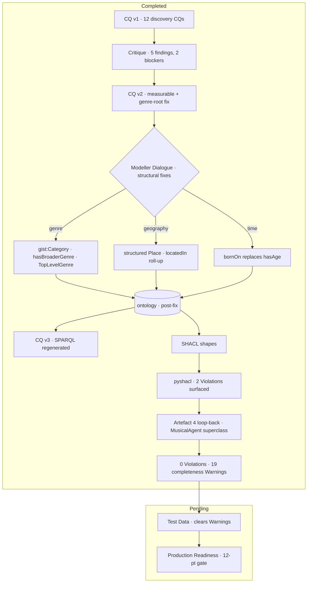
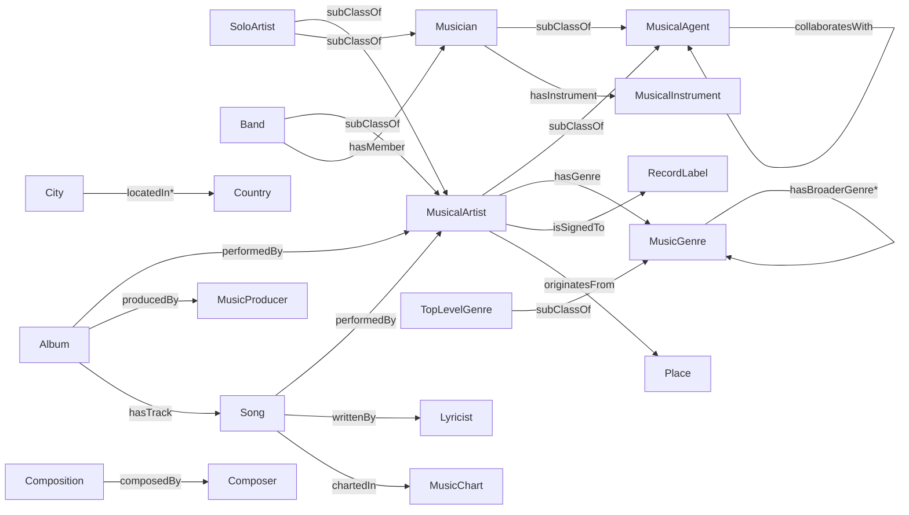

# Music Ontology

A **gist-aligned OWL 2 ontology** of the popular- and classical-music domain, built to power a
**music discovery / recommendation** application — and, just as importantly, a worked example of
the **GRL Workshop methodology** (Graph Research Labs, KGC 2026) for engineering ontologies with
LLMs as disciplined pair-modellers.

- **Namespace:** `:` → `https://www.somusicvocabulary.org/music#`
- **Upper ontology:** `gist:` → `https://w3id.org/semanticarts/ontology/gistCore#`
- **Scope:** content-based candidate generation (no user/interaction/rating is modelled)
- **Maturity:** research prototype

---

## The approach

Rather than hand-authoring the ontology and hoping it's right, the model is driven through a
disciplined lifecycle: **every requirement is a testable competency question, every generated
artefact is adversarially critiqued, every fix enumerates its downstream regenerations, and the
result is validated by machine (`rdflib` + `pyshacl`) rather than by assertion.**

### High-level — the methodology arc


### Detailed — the journey so far



Key decision points along the way:
- **RDF over LPG** — the discovery use case shapes *which questions* we ask, not the storage tech;
  the model stays RDF/OWL (reasoning, SHACL, SPARQL, interoperability).
- **Genres as `gist:Category`, not OWL subclasses** — genre is a cross-cutting facet over artists,
  albums, and songs; subclassing it wouldn't deliver transitivity through `:hasGenre` and would
  fight the team style guide. The chosen pattern gives sound transitive traversal via the
  `owl:TransitiveProperty` `:hasBroaderGenre`, with top genres marked `:TopLevelGenre`.
- **Structure beats free text** — geography became a `:Place`/`:City`/`:Country` graph with
  transitive `:locatedIn` (enabling "artists from England"), and the time-varying `:hasAge` became
  a stable `:bornOn` date.

---

## The model at a glance



~50 classes / ~38 properties across agents, works, a genre taxonomy, instruments,
events/venues, awards/charts, places, and musical features (key, tempo, time signature).

---

## Repository layout

| Path | Contents |
|------|----------|
| `ontology/` | the `.ttl` files: `music_vocabulary_comprehensive.ttl` (model + instances), `music_vocabulary_shapes.ttl` (SHACL) |
| `scripts/` | transform + validation scripts |
| `sdd/` | spec-driven-development control docs: `spec.md`, `plan.md` |
| `docs/` | engineering deliverables: `competency-questions.md`, `shacl-report.md` |
| `CLAUDE.md` | guidance for Claude Code working in this repo |
| `prompt_library/` *(local-only)* | the seven GRL Workshop prompts — git-ignored |

---

## Running the validation

Requires [`uv`](https://docs.astral.sh/uv/) (Python pinned to 3.14).

```bash
uv sync

# Model checks: parse + SPARQL exercising genre traversal, place roll-up, etc.
uv run python scripts/validate_fixes.py

# SHACL conformance (type-checks as Violations, completeness as Warnings)
uv run pyshacl -s ontology/music_vocabulary_shapes.ttl -m -f human \
  ontology/music_vocabulary_comprehensive.ttl
```

The transform that applied the structural fixes is preserved and re-runnable at
`scripts/apply_structural_fixes.py`.

---

## Status & next steps

| Phase | State |
|-------|-------|
| CQ generation → critique → revision (v3) | ✅ done |
| Modeller Dialogue — structural fixes | ✅ done (validated) |
| SHACL generation | ✅ done — `docs/shacl-report.md` |
| Resolve `:Musician` ↔ `:MusicalArtist` boundary | ✅ done — `:MusicalAgent` superclass; **0 Violations** |
| Test data + CQ tests | ⏳ next (clears the 19 completeness Warnings) |
| Production readiness (12-pt gate) | ⏳ pending |

See [`sdd/plan.md`](sdd/plan.md) for the live lifecycle tracker and [`sdd/spec.md`](sdd/spec.md)
for the specification.
